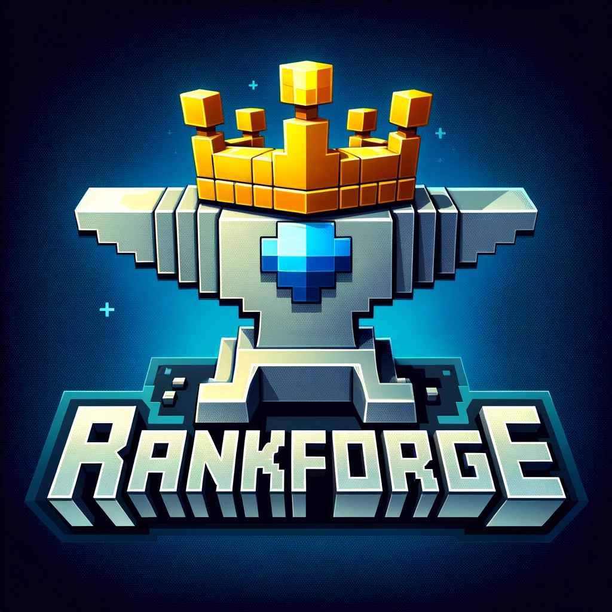

  

<h3 align="center">One plugin to rank them all</h3>

# RankForge

RankForge is a comprehensive ranking plugin for Minecraft servers, designed to seamlessly integrate with your server's existing systems to provide a robust and flexible ranking experience.

## Features

- **Customizable Ranks**: Easily create and manage player ranks with custom permissions and benefits.
- **Integration**: Designed to work effortlessly with other plugins and server setups.
- **API**: Built with an easy to use API, in order to communicate with other plugins

## Installation

1. Download the RankForge plugin from [SpigotMC](https://www.spigotmc.org/resources/).
2. Place the `RankForge.jar` file into your server's `plugins` directory.
3. Restart your server to load the plugin.
4. Configure the plugin to your liking using the `config.yml` file.

## Documentation

For detailed information on setup, configuration, and features, please refer to the [RankForge Wiki](#).

## Support

If you encounter any issues or have questions, please visit our [Support Page](#) or join our [Discord community](#).

## Contributing

We welcome contributions from the community! If you're interested in helping to improve RankForge, please check out our [Contributing Guidelines](#).

## License

RankForge is released under the [MIT License](#).

Thank you for choosing RankForge for your Minecraft server!

